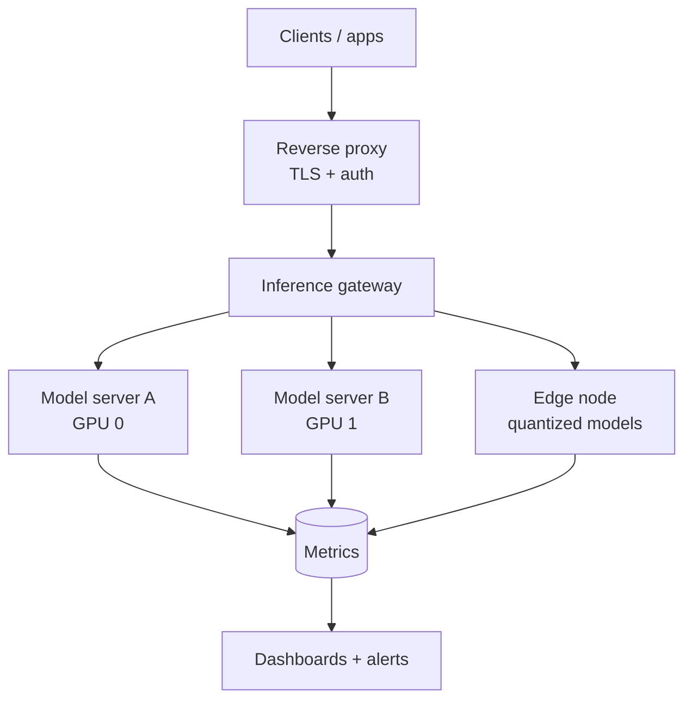

<!-- Copyright © 2026 SurgeXi Business Intelligence, a Teamsmith Enterprises LLC company. All Rights Reserved. -->
# 🖥️ onprem-ai-infra

> Proof of **air-gapped, on-prem AI competence** — running production-grade GPU inference on your own iron, private by construction, with nothing phoning home.

[](https://github.com/tsmith-surgexi/onprem-ai-infra/actions/workflows/ci.yml)
[](LICENSE)
[](.github/workflows/ci.yml)

**What this demonstrates.** How I stand up and operate self-hosted model serving on real hardware — the topology, the hardening baseline, the GPU/latency monitoring, and the runbooks for when it breaks — instead of renting inference from a cloud. It's the on-prem, data-stays-on-your-network foundation a serious privacy-first AI platform sits on: low-latency, private, and fully under your control — the same posture behind SurgeXi's node-first products. Shareable because it's *how* I run infrastructure; the models and data that run on it stay private. Provisioning and quick start are below.

---

## The rig

| Component | Role |
|-----------|------|
| Workstation-class host (dual-GPU) | Primary inference — large local models |
| Edge compute node | Low-power on-site edge inference |
| Containerized model servers | OpenAI-compatible serving behind one gateway |
| Reverse proxy + TLS | Single secure entry point |
| Monitoring stack | GPU utilization, latency, and health dashboards |

## Topology



## What's in here

- **`compose/`** — Docker Compose stacks for model servers, gateway, and monitoring
- **`provisioning/`** — host setup: GPU drivers, container runtime, hardening baseline
- **`monitoring/`** — dashboards for GPU memory, throughput, and request latency
- **`docs/`** — capacity planning, quantization trade-offs, and a runbook for common failures

## Why on-prem?

| Concern | On-prem answer |
|---------|----------------|
| **Privacy** | Data never leaves your network |
| **Cost** | No per-token cloud bill on high-volume workloads |
| **Latency** | Sub-second local responses |
| **Control** | Your models, your versions, your uptime |

## Quick start

```bash
git clone https://github.com/tsmith-surgexi/onprem-ai-infra.git
cd onprem-ai-infra
# 1. Provision the host (drivers, runtime, hardening)
sudo ./provisioning/setup.sh
# 2. Bring up the inference + monitoring stack
docker compose -f compose/inference.yaml up -d
docker compose -f compose/monitoring.yaml up -d
```

## Hardening baseline

Even a private rig gets treated like production: least-privilege service accounts, no model server exposed directly to the internet, TLS at the edge, and a single authenticated gateway in front of every model. Full notes in [`docs/hardening.md`](docs/hardening.md).

## Roadmap

- [ ] Automated model warm-up + readiness gating
- [ ] GPU autoscaling across additional nodes
- [ ] Backup/restore for vector stores and configs

## Architecture & case study

For the full write-up — problem framing, architecture diagrams, sequence
flows, design-decision records (ADRs), and trade-offs — see
**[ARCHITECTURE.md](ARCHITECTURE.md)** and the [ADRs](docs/adr/).

## License
© 2026 SurgeXi Business Intelligence, a Teamsmith Enterprises LLC company. All Rights Reserved.
Source-available for evaluation only — see LICENSE.

